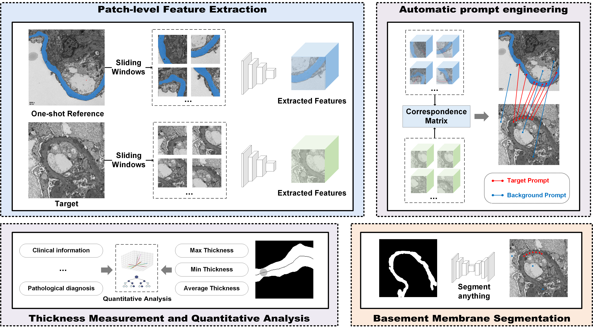

# Feature-prompting GBMSeg: One Shot Reference Guided Training-Free Feature Matching for Glomerular Basement Membrane Segmentation and Quantification
<br>**[Xueyu Liu](https://scholar.google.com.hk/citations?user=jeatLqIAAAAJ&hl=zh-CN), Guangze Shi, Weixia Han, Xinyu Wang, Lele Sun, Quan Yang, Rui Wang,  Jianan Zhang, Yexin Lai,  Ming Li, Xiaoshuang Zhou, Wen Zheng, Yongfei Wu, Chen Wang**<br>


<p align="center">

</p>

We present GBMSeg, a training-free framework that automates the segmentation and measurement of the glomerular basement membrane (GBM) in TEM using only one-shot reference images. GBMSeg leverages the robust feature matching capabilities of pretrained foundation models (PFMs) to generate initial prompts, designs novel prompting engineering for optimized prompting methods, and utilizes a class-agnostic segmentation model to obtain the final segmentation result. Additionally, we propose a thickness measurement method based on the segmentation mask to quantify pathological indicators and analyze and predict results by integrating clinical indicators with diagnostic outcomes. 

<p align="center">

</p>

## To do 
- [ ] Release code

## Usage 
### Setup 

### Generate prompt

```
cd HSNet 
python Eval.py
```

## Acknowledgement
Thanks [DINOV2](https://github.com/facebookresearch/dinov2), [SAM](https://github.com/facebookresearch/segment-anything). for serving as building blocks of GBMSeg.
